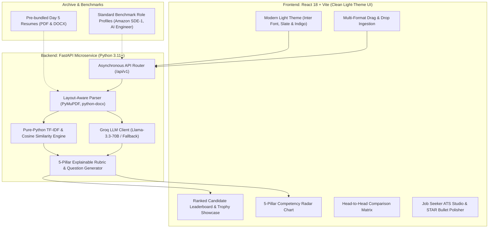

# TalentIntel AI — Enterprise AI Talent Intelligence & ATS Platform (2026 Edition)

An enterprise-grade, full-stack AI talent intelligence platform and dual-persona ATS optimization engine built with **FastAPI**, **React (Vite)**, and **Groq Ultra-Low Latency Inference**.

Transformed and elevated from an experimental single-file CLI script into a cloud-native, asynchronous recruitment intelligence platform featuring a **clean light-theme design system**, **5-pillar explainable scoring rubrics**, **side-by-side candidate comparison matrices**, and a **job-seeker STAR-method bullet point optimizer**.

---

## 🌟 Architecture & Data Flow



---

## 🚀 Key Features

### 1. Dual-Persona Experience
- **Recruiter Talent Radar**: Batch candidate evaluation, ranked leaderboard, top candidate trophy showcase, verified skills vs. missing gap analysis, and one-click CSV export.
- **Job Seeker ATS Optimization Studio**: Real-time ATS pass-probability gauge, critical missing keyword alerts, and **AI Bullet Point Polish using the STAR (Situation, Task, Action, Result) methodology** with quantifiable metrics.

### 2. 5-Pillar Explainable Rubric (XAI)
Unlike opaque black-box AI matchers, candidate fit is calculated transparently across 5 weighted dimensions:
- **Hard Skills Match (35%)**: Token-level alignment with required technologies and tools.
- **Experience Relevance & Tenure (25%)**: Alignment of total years of experience, relevant industry domains, and seniority.
- **Quantifiable Impact & STAR Metrics (20%)**: Evidence of measurable results, metrics, and business outcomes.
- **Academic / Degree Fit (10%)**: Degree level and STEM field relevance.
- **Career Velocity & Trajectory (10%)**: Promotion pace, learning agility, and leadership indicators.

### 3. Dynamic Technical Interview Question Generator
Automatically synthesizes 3-4 deep technical interview questions per candidate designed specifically to probe identified resume gaps and ambiguous tenure claims.

### 4. Head-to-Head Candidate Comparison Matrix
Select any two candidates to view a dual-series overlay radar chart, directly comparing skills, experience, and hiring verdicts side by side.

### 5. Multi-Format & Zero-Dependency Ingestion
- High-fidelity extraction for **PDF** (`pypdf`), **Word** (`python-docx`), and text.
- High-speed, pure-Python TF-IDF vector similarity engine running in milliseconds with zero heavy wheel dependencies.

---

## 🛠️ Technology Stack

| Layer | Technologies |
| :--- | :--- |
| **Frontend** | React 18, Vite, Lucide Icons, Recharts (Radar charts), Canvas-Confetti, Plus Jakarta Sans |
| **Backend** | FastAPI, Uvicorn, Pydantic v2 (Strict Schema Validation), Python-Multipart |
| **AI / LLM** | Groq Cloud API (`llama-3.3-70b-versatile` / `openai/gpt-oss-120b`), Structured JSON Prompting |
| **Document Processing** | `pypdf`, `python-docx` |
| **DevOps & Cloud** | Docker, Docker Compose, Multi-Stage Nginx Build, GitHub Actions CI/CD ready |

---

## ⚡ Quick Start Guide

### Prerequisites
- Python 3.11+
- Node.js 18+ & npm
- (Optional) Groq API Key from [console.groq.com](https://console.groq.com) (or use the built-in Intelligent Demo Engine!)

### Option A: Local Development

#### 1. Start the FastAPI Backend
```bash
# Navigate to backend directory
cd backend

# Create virtual environment & install dependencies
python -m venv .venv
source .venv/bin/activate  # On Windows: .venv\Scripts\activate
pip install -r requirements.txt

# Run the API server (runs at http://localhost:8000)
uvicorn app.main:app --reload --host 0.0.0.0 --port 8000
```
Interactive Swagger API documentation will be available at: `http://localhost:8000/docs`.

#### 2. Start the React Frontend
```bash
# In a new terminal, navigate to frontend
cd frontend

# Install packages
npm install

# Start Vite dev server (runs at http://localhost:5173)
npm run dev
```

### Option B: Run with Docker Compose
```bash
docker-compose up --build
```
- Frontend UI: `http://localhost:3000`
- Backend API & Docs: `http://localhost:8000/docs`

---

## 🧪 Testing the 4 Bundled Day 5 Resumes

The platform comes pre-configured with the sample resumes from the Day 5 repository:
1. `Ashish Raj 24PCS007 (1) - Ashish Raj.pdf`
2. `abhay resume new - Abhay Singh.pdf`
3. `Resume for Freshers - Priyanshu Singh.docx`
4. `anshit verma resume word - Anshit Verma.docx`

To evaluate them:
1. Open the UI at `http://localhost:5173`.
2. Select the **Amazon SDE-I** benchmark job profile.
3. Click the **"Use 4 Day 5 Sample Resumes"** button.
4. Click **"Run AI Candidate Evaluation"**. The ranked leaderboard, radar breakdowns, and top candidate trophy will render instantly!

---

## 💼 Resume & Portfolio Storyline

You can feature this project on your software engineering and AI engineer resume:

> **TalentIntel AI | Full-Stack AI Engineer**
> - Architected an asynchronous resume intelligence platform using **FastAPI**, **Groq LLM inference**, and **Pydantic v2**, achieving sub-second parsing and structured entity extraction across PDF and DOCX formats.
> - Implemented an explainable 5-pillar scoring rubric combining sublinear TF-IDF vector cosine similarity with LLM qualitative analysis, evaluating hard skills, experience trajectory, and STAR-method impact metrics.
> - Developed a modern, clean light-themed **React** application with **Recharts** radar visualizations, a head-to-head candidate comparison matrix, and a dual-persona job-seeker ATS optimizer with AI bullet point rewriting.
> - Containerized the multi-tier application using **Docker Compose** and authored modular RESTful endpoints documented via OpenAPI/Swagger.

---

## 📄 License
MIT License. Created for the AI Engineer roadmap.
